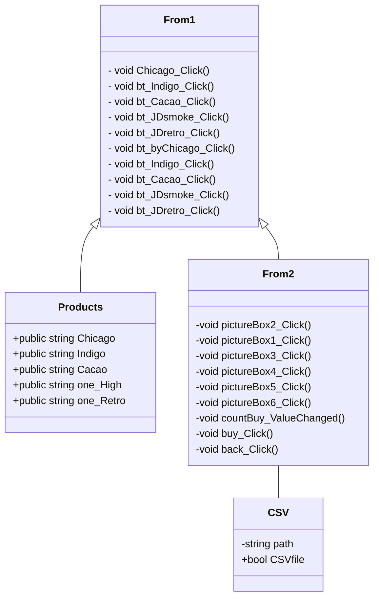

# ความเป็นมาของโปรแกรม
### โปรแกรมนี้สร้างขึ้นเพื่อใช้สำหรับการขายรองเท้าออนไลน์ 
# วัตถุประสงค์ของโปรแกรม
### โปรแกรมนี้จัดทำขึ้นไว้สำหรับผู้ที่สนใจที่จะซื้อรองเท้า หรือกำลังหาข้อมูลรองเท้าและราคา หรือถ้าหากสนใจก็สามารถสั่งซื้อในตัวโปรแกรมนี้ได้ เพราะมีการคำนวณราคารวมของสินค้าแสดงให้ดู
# ชื่อของผู้พัฒนาโปรแกรม
### นางสาวกันทิมา พิมรัตน์ 663450033-9
